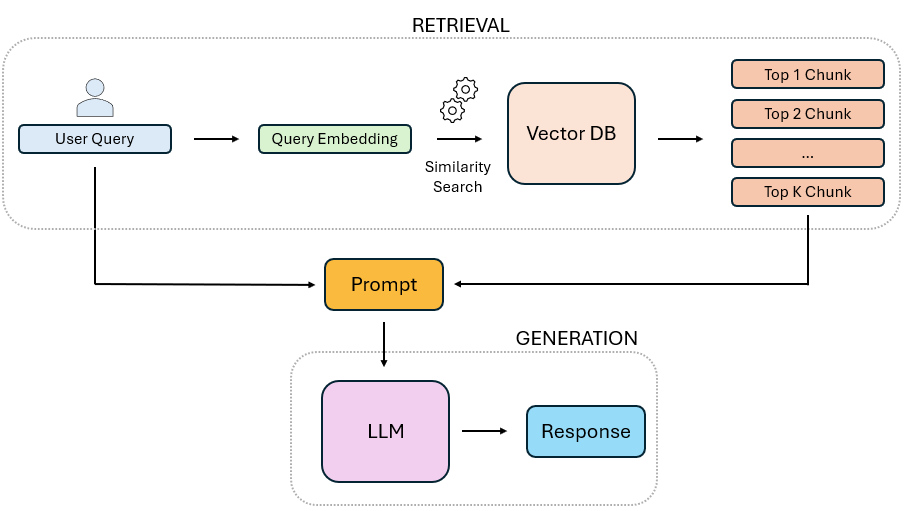

# Vectoria: Supercomputer-driven Vector Database for Private LLM Retrieval

Vectoria is an advanced, AI-driven solution for optimizing organizational knowledge access through private large language model (LLM) retrieval. It enables seamless interaction with internal documentation via chatbot-like interfaces while maintaining high standards of data privacy and precision.

## Key Features
- **Efficient Knowledge Management**: Unified access to scattered internal documentation through a centralized query system.
- **High Precision and Relevance**: Leverages vector-based retrieval techniques for precise query matching.
- **Data Privacy**: Operates entirely within the organization’s infrastructure, ensuring compliance with internal security protocols.

---

## Architectural Overview

Vectoria’s architecture consists of tightly integrated components to deliver exceptional performance and accuracy. Below are the core modules and workflows:

### Core Modules:
1. **Document Preprocessor**: Ingests, cleans, and splits internal documents into manageable text chunks.
2. **Vector Database**: Stores vector embeddings of document chunks for efficient similarity searches.
3. **Retriever**: Locates relevant chunks from the vector database based on user queries.
4. **Generative Model**: Synthesizes human-like answers using a pre-trained large language model.

### Operational Tasks:
1. **Build Vector Database**:
   - Transforms internal documents into a searchable structure (referred to as "Build Index").
   - Supported formats: PDF, DOCX.
2. **Inference**:
   - Combines retrieval and generative AI to provide context-aware responses.

---

## Workflows

### Build Vector Database


**Steps:**
1. **Data Preprocessing**: Cleans and splits documents into chunks (e.g., 512 characters).
2. **Data Embedding**: Generates vector embeddings using pre-trained models (e.g., `bge-m3`).
3. **Data Storing**: Stores embeddings in a vector database (e.g., FAISS), attaching metadata for efficient filtering and explainability.

**Example Command:**
```bash
python vectoria \
  --config 'etc/default/default_config.yaml' \
  build_index \
  --input-docs-dir 'test/data' \
  --output-dir 'test/index' \
  --output-suffix '_my_test_index'
```

**Arguments:**

- `--config`: Path to the configuration file. Example: `'etc/default/default_config.yaml'`.
- `build_index`: Specifies the command to build the vector index.
- `--input-docs-dir`: Directory containing the input documents for indexing.
- `--output-dir`: Directory where the generated vector index will be saved.
- `--output-suffix`: Optional suffix appended to the output index name.

**Output:**

```bash
INFO - Running preprocessing pipeline - preprocessing_pipeline.py - 75
INFO - Found 2 files - preprocessing_pipeline.py - 77

DEBUG - Extracting text from /path/to/data/1.pdf - extraction_pdf.py - 28
DEBUG - Extracting text from /path/to/data/2.pdf - extraction_pdf.py - 28

DEBUG - Loaded 24815 characters - extraction_pdf.py - 38
DEBUG - Seeking and replacing remove_multiple_spaces ... - utils.py - 16
DEBUG - Seeking and replacing remove_bullets ... - utils.py - 16
...     ...                                        ...				
DEBUG - Processing file /path/to/data/1.pdf took 1.21 seconds - preprocessing_pipeline.py - 102

DEBUG - Loaded 27417 characters - extraction_pdf.py - 38
DEBUG - Seeking and replacing remove_multiple_spaces ... - utils.py - 16
DEBUG - Seeking and replacing remove_bullets ... - utils.py - 16
...     ...                                        ...
DEBUG - Processing file /path/to/data/1.pdf took 1.28 seconds - preprocessing_pipeline.py - 102

INFO - Total number of chunks: 208 - preprocessing_pipeline.py - 95
INFO - Created 208 documents from /path/to/data/pdf in 1.52 seconds - build_index.py - 25
INFO - Building FAISS vector store - vectore_store_builder.py - 32
INFO - Loading Embedder model: /path/to/embedder - faiss_vector_store.py - 35
```

### Inference Workflow



**Steps:**

1. **Query Reception**: Accepts user questions via CLI or file input.
2. **Query Embedding**: Converts the query into a vector embedding using a pre-trained model.
3. **Vector Search**: Finds the top-k most relevant chunks using similarity metrics from the vector database.
4. **Prompt Construction**: Combines retrieved chunks with the query to provide context for the response.
5. **Answer Generation**: Uses a generative AI model (e.g., `Llama-3.1`) to produce natural language answers.

**Example Command:**

```bash
python vectoria \
  --config 'etc/default/default_config.yaml' \
  inference \
  --faiss-index-path 'test/data/index/my_new_test_faiss_index/index.pkl' \
  --test-set-path 'test/data/results/my_questions.json' \
  --questions 'Who is the CEO?' 'Who is the VP?' \
  --output-dir 'test/data/results'
```

N.B.: --test-set-path and --questions are both not formally strictly required, since vectoria is able to handle a dual mode. Using --questions argument will override questions from --test-set-path and will provide answers only through CLI, avoiding any dump on file. IMPORTANT: at least one MUST be provided.


**Arguments:**

- `--config`: Path to the configuration file. Example: `'etc/default/default_config.yaml'`.
- `inference`: Specifies the command to perform inference on the vector database.
- `--faiss-index-path`: Path to the FAISS index file containing precomputed vector embeddings.
- `--test-set-path`: List of user questions for inference sourced from a file.
- `--questions`: List of user questions for inference provided as separate strings.
- `--output-dir`: Directory where inference results, such as generated answers, will be saved.

